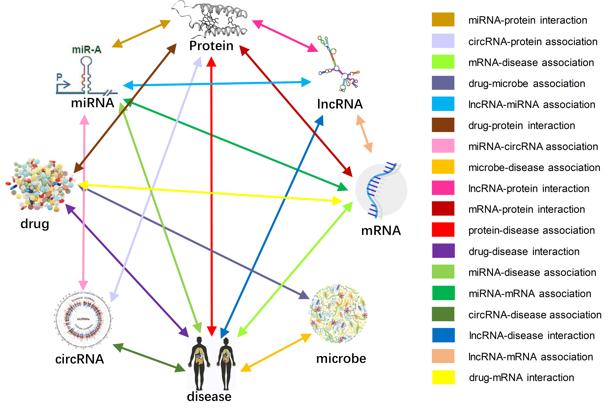

# MMI-Pred
Codes and data for the paper entitled "Learning representations of molecules to predict intermolecular interactions by constructing a large-scale heterogeneous molecular association network"
### Molecular Association Network：
contains 8 kinds of molecules, 18 types of associations, 14,315 nodes, 114,150 molecular associations.  
  
The associations among miRNA, mRNA, circRNA, lncRNA, protein, drug, disease, and microbe, including miRNA-disease associations, circRNA-disease associations, circRNA-miRNA associations, disease-mRNA associations, disease-microbe associations, drug-disease interactions, drug-mRNA associations, drug-microbe associations, drug-protein interactions, lncRNA-disease associations, lncRNA-mRNA associations, lncRNA-miRNA associations, lncRNA-protein interactions, miRNA-drug associations, miRNA-mRNA associations, miRNA-protein interactions, mRNA-protein associations, protein-protein interactions. 
### Usage manual
#### Performance evaluation
##### Data processing
Read the original association to construct the MAN network, and number the nodes
```
python MainFirst.py 
```
Randomly select the same number of negative samples as the positive samples from the association matrix, and and divide all samples into 5-fold for subsequent cross-validation.
```
python MainSecond.py
```
Obtain the network behavior features (network embedding) of biomolecule nodes in the MAN network
```
python SecondOpenNE-master/prepareFea.py
```
Generate attribute features, network behavior features, and attribute + network behavior features required for cross-validation
```
python MainThird.py
```
##### Cross-validation: 
(The codes are in the "Train5Fold\" directory)

The performance of attribute + behavior(manner) features 
```
python attribute+manner.py
```
The performance of attribute feature
```
python attribute.py
```
The performance of network behavior feature
```
python manner.py
```
Classifier comparison 
(The codes are in the "Train5Fold\4-ClassifierCompare" directory)
```
# Run the following command in the folder of each classifier
python attribute+manner.py 
```
##### case study
Code and data are in the "case study\3TrainTestAttribute+Embedding" directory
```
python attribute+manner_casestudy.py
```
### Test individual types of interactions
This can be regarded as a link prediction problem on MAN. 
Evaluating the performance of the proposed method for a specific interaction (e.g., a protein-protein interactions) can be done as follows.
```
1. Remove the protein-protein interaction pairs (links) from molecular association network as training set. 
(Just comment out the csv file name  corresponding to the type of interaction to be tested (for example: PPI.csv) when reading all the associations to build the network.)

2. Training the proposed MMI-Pred model using training set.

3. Using protein-protein interaction pairs as the test set to test the performance of the model.

```
### Requirements
```python
openne
numpy==1.14
networkx==2.0
scipy==0.19.1
tensorflow>=1.15.2
gensim==3.0.1
scikit-learn==0.19.0
```
### Citation:
Yi, H.-C. et al. Learning representations to predict intermolecular interactions on large-scale heterogeneous molecular association network. iScience, doi:10.1016/j.isci.2020.101261.

Contact: haichengyi#gmail.com
